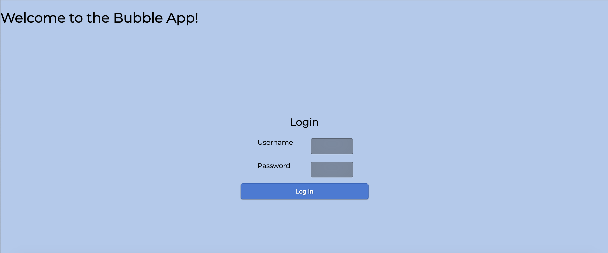
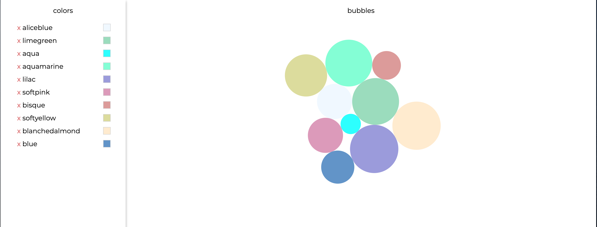

# React-SPA-Bubbles

A React application that requires a login to show a protected page. Using a JSON Web Token to authenticate requests. The application supports following requests":

GET colors, PUT a changed color, and DELETE a color. 

# API Documentation
[POST] * to /api/login: returns a token to be added to the header of all other requests. Pass in the following credentials as the body of the request: { username: 'Test', password: '123' }
[GET] to /api/colors: returns the list of colors and their hex codes.
[POST] to /api/colors: creates a new color object. Pass the color as the body of the request (the second argument passed to axios.post).
[PUT] to /api/colors/:id: updates the color using the id passed as part of the URL. Send the color object with the updated information as the body of the request (the second argument passed to axios.put).
[DELETE] to /api/colors/123: removes the color using the id passed as part of the URL (123 in example).

